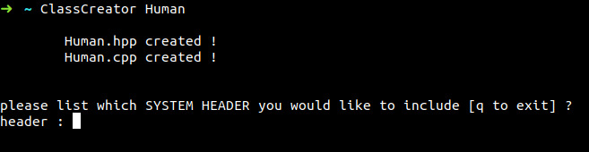
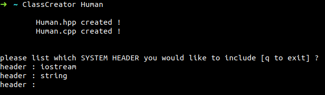

# ClassCreator.sh

**A simple script to create Class in cpp easier !
This script will ask you for a ClassName and create both ClassName.cpp and ClassName.hpp formated as Coplien formA simple script to create Class in cpp easier !
This script will ask you for a ClassName and create both ClassName.cpp and ClassName.hpp formated as Coplien form******

## How to Install it ?

Commands to install and alias it
```bash
cd ~
git clone https://github.com/tclaudel/ClassCreator.sh ClassCreator
alias ClassCreator=~/ClassCreator/./ClassCreator.sh
cd -
```
> The best thing to do is to set your aliases in your ~/.zshrc or ~/.bashrc

## How to use it ?
```bash
ClassCreator <insert your classname>
```
>If you do not insert class name, the programm will ask you.
> if you havent't alias it please ./ClassCreator.sh. Do not use sh to lunch it !

If your class is a child from another :
```bash
ClassCreator <child classname> <mother classname>
```

Now insert the libraries to include *ex : string iostream*

And your own libraries *ex : mother.hpp*