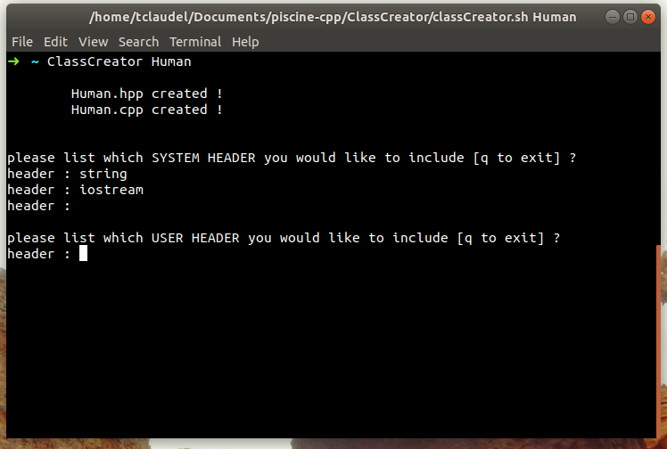

# ClassCreator.sh

- A simple script to create *Class* in cpp easier !

- This script will ask you for a *ClassName* and create both *ClassName.cpp* and *ClassName.hpp* formated as *Coplien form*

## How to Install it ?

Commands to install and alias it
```bash
cd ~
git clone https://github.com/tclaudel/ClassCreator.sh ClassCreator
alias ClassCreator=~/ClassCreator/./ClassCreator.sh
cd -
```
> The best thing to do is to set your aliases in your ~/.zshrc or ~/.bashrc

## How to use it ?
```bash
ClassCreator <insert your classname>
```
>If you do not insert class name, the programm will ask you.
> if you havent't alias it please ./ClassCreator.sh. Do not use sh to lunch it !

If your class is a child from another :
```bash
ClassCreator <child classname> <mother classname>
```

<p align="center">
  
</p>

> Now insert the libraries to include *ex : string iostream*

<p align="center">
  
</p>

> And your own libraries *ex : mother.hpp*

<p align="center">
  
</p>

> Now set the private vars in your class, after the type and the name, write 's'
if your want to have setter and 'g' to have getters, or 'sg' for both.

<p align="center">
  
</p>

## Now enjoy it !

###### Please leave a star if you find it usefull ! Thanks for using it
[42 Intra profile](https://profile.intra.42.fr/users/tclaudel "Intra profile")
